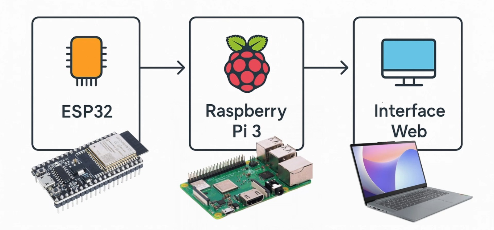
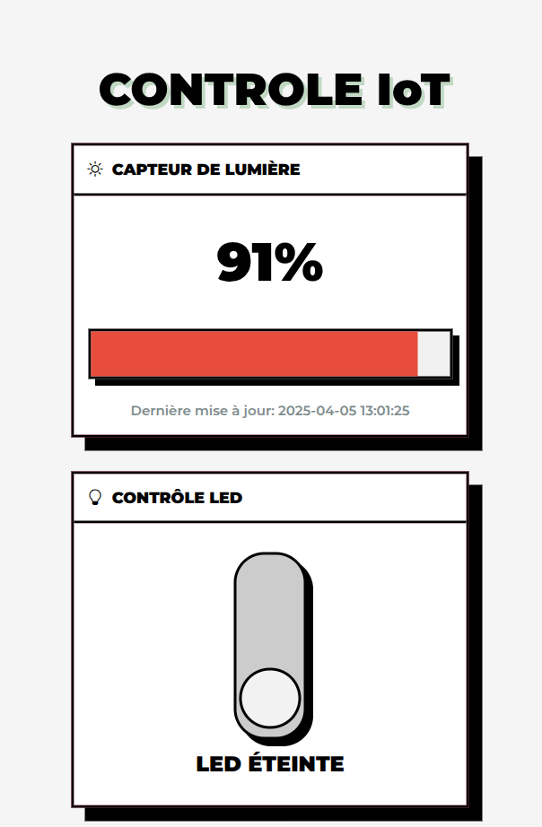

The goal of this project is to design and implement a system to **control and monitor** **ESP32 modules** (LED, photoresistor, buzzer, etc.) remotely via a **web browser**.

---
Here is the web interface. 

  

Don't be shy, check the 'journal de bord'. 